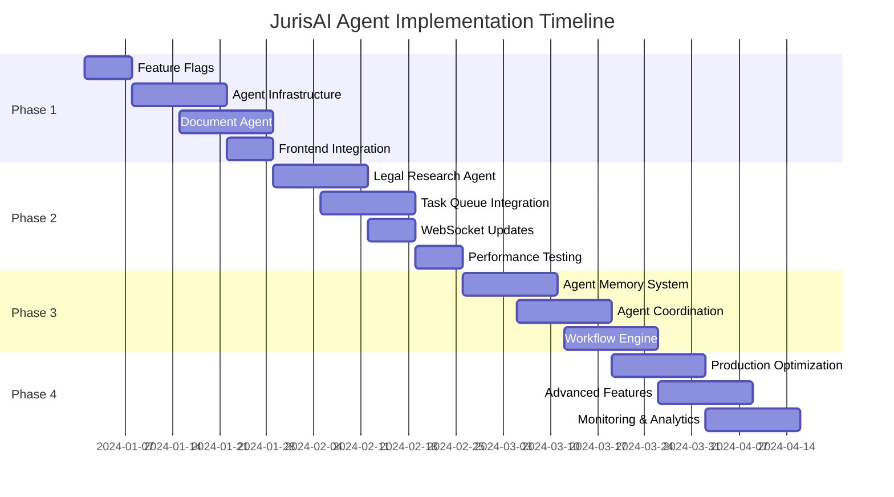

# JurisAI Agent System Implementation Plan

## Executive Summary

This document provides a pragmatic, risk-mitigated implementation plan for transforming JurisAI into an agent-based legal AI platform. The plan prioritizes incremental delivery, backward compatibility, and minimal disruption to existing operations while delivering measurable value at each phase.

## Critical Analysis Findings

### Architectural Gaps Identified
- **Integration Complexity**: Proposed agent architecture may conflict with existing FastAPI/React structure
- **State Management Conflicts**: Tension between stateless agents and persistent workflow requirements
- **Performance Unknowns**: No benchmarks for agent orchestration overhead
- **Resource Scaling**: Unclear GPU/memory requirements for production agent workloads

### Risk Assessment
- **High Risk**: Full orchestration layer could destabilize existing system
- **Medium Risk**: Development timeline may exceed MVP goals
- **Medium Risk**: Infrastructure costs could increase dramatically
- **Low Risk**: User adoption if properly feature-flagged

## Implementation Strategy

### Core Principles
1. **Start Small, Think Big**: Begin with single agent, expand gradually
2. **Leverage Existing Infrastructure**: Use current FastAPI, PostgreSQL, Redis setup
3. **Graceful Fallbacks**: Always maintain working legacy functionality
4. **Incremental Value**: Deliver user value at each phase
5. **Data-Driven Decisions**: Measure performance and adoption at each step

## Phase 1: Foundation (Weeks 1-4)

### Objectives
- Implement feature flag infrastructure
- Create single Document Analysis Agent
- Establish agent task tracking
- Minimal disruption to existing system

### Technical Implementation

#### 1.1 Feature Flag Infrastructure
```python
# apps/backend/src/services/feature_flags.py
from sqlalchemy.orm import Session
from typing import Optional, Dict, Any
import hashlib

class FeatureFlagService:
    def __init__(self, db: Session, cache_service):
        self.db = db
        self.cache = cache_service
    
    async def is_enabled(self, flag: str, user_id: str) -> bool:
        """Check if feature flag is enabled for user"""
        cache_key = f"flag:{flag}:{user_id}"
        
        # Check cache first
        cached = await self.cache.get(cache_key)
        if cached is not None:
            return cached == "1"
        
        # Get from database
        flag_config = await self._get_flag_config(flag)
        if not flag_config or not flag_config.get('enabled'):
            return False
        
        # Check rollout percentage
        rollout = flag_config.get('rollout_percentage', 0)
        if rollout < 100:
            user_hash = int(hashlib.md5(user_id.encode()).hexdigest(), 16) % 100
            if user_hash >= rollout:
                return False
        
        # Cache result
        await self.cache.set(cache_key, "1" if True else "0", expire=300)
        return True
```

#### 1.2 Agent Task Schema
```sql
-- Database migration: Add agent task tracking
CREATE TABLE agent_tasks (
    id UUID PRIMARY KEY DEFAULT gen_random_uuid(),
    document_id UUID REFERENCES documents(id),
    user_id UUID REFERENCES users(id),
    agent_type VARCHAR(100) NOT NULL,
    task_type VARCHAR(100) NOT NULL,
    status VARCHAR(50) DEFAULT 'pending',
    parameters JSONB,
    result JSONB,
    error_message TEXT,
    confidence_score FLOAT,
    processing_time_ms INTEGER,
    created_at TIMESTAMP DEFAULT NOW(),
    started_at TIMESTAMP,
    completed_at TIMESTAMP,
    
    INDEX idx_agent_tasks_user_status (user_id, status),
    INDEX idx_agent_tasks_document (document_id),
    INDEX idx_agent_tasks_created (created_at)
);

-- Add agent processing fields to existing documents table
ALTER TABLE documents ADD COLUMN agent_processing_status VARCHAR(50);
ALTER TABLE documents ADD COLUMN agent_last_analysis TIMESTAMP;
```

#### 1.3 Document Analysis Agent Service
```python
# apps/backend/src/services/agents/document_analyzer.py
from typing import Dict, Any, Optional
from datetime import datetime
from dataclasses import dataclass
import asyncio

@dataclass
class AgentTaskContext:
    task_id: str
    user_id: str
    document_id: str
    parameters: Dict[str, Any]
    
class DocumentAnalysisAgent:
    def __init__(self, db_session, existing_summarizer_service):
        self.db = db_session
        self.summarizer = existing_summarizer_service
        self.agent_type = "document_analyzer"
    
    async def analyze_document(self, context: AgentTaskContext) -> Dict[str, Any]:
        """Enhanced document analysis with agent intelligence"""
        
        # Update task status
        await self._update_task_status(context.task_id, "processing")
        
        try:
            # Get document
            document = await self._get_document(context.document_id)
            
            # Enhanced analysis pipeline
            results = {}
            
            # Step 1: Basic analysis (leverage existing service)
            basic_summary = await self.summarizer.summarize_document(
                document.content, max_length=500
            )
            results['summary'] = basic_summary
            
            # Step 2: Agent-enhanced entity extraction
            entities = await self._enhanced_entity_extraction(document.content)
            results['entities'] = entities
            
            # Step 3: Document type classification
            doc_type = await self._classify_document_type(document.content)
            results['document_type'] = doc_type
            
            # Step 4: Risk assessment (for contracts/legal docs)
            if doc_type in ['contract', 'agreement', 'legal_document']:
                risk_analysis = await self._assess_document_risks(document.content)
                results['risk_analysis'] = risk_analysis
            
            # Calculate confidence
            confidence = self._calculate_confidence(results)
            
            # Store results
            await self._store_results(context.task_id, results, confidence)
            
            return {
                'task_id': context.task_id,
                'status': 'completed',
                'results': results,
                'confidence': confidence,
                'agent_type': self.agent_type
            }
            
        except Exception as e:
            await self._handle_error(context.task_id, str(e))
            raise
    
    async def _enhanced_entity_extraction(self, text: str) -> Dict[str, Any]:
        """Enhanced entity extraction with legal focus"""
        # Integrate with existing NLP models
        # Add legal-specific entity recognition
        return {
            'parties': [],
            'dates': [],
            'monetary_amounts': [],
            'legal_references': [],
            'locations': []
        }
    
    async def _classify_document_type(self, text: str) -> str:
        """Classify document type for targeted analysis"""
        # Use existing or new ML model for classification
        return "contract"  # Placeholder
    
    async def _assess_document_risks(self, text: str) -> Dict[str, Any]:
        """Risk assessment for legal documents"""
        return {
            'risk_level': 'medium',
            'risk_factors': [],
            'recommendations': []
        }
    
    def _calculate_confidence(self, results: Dict[str, Any]) -> float:
        """Calculate confidence score based on results quality"""
        return 0.85  # Placeholder logic
```

#### 1.4 FastAPI Integration
```python
# apps/backend/src/routes/agents.py
from fastapi import APIRouter, Depends, HTTPException, BackgroundTasks
from sqlalchemy.orm import Session
from typing import Dict, Any

router = APIRouter(prefix="/api/v1/agents", tags=["agents"])

@router.post("/analyze-document/{document_id}")
async def analyze_document_with_agent(
    document_id: str,
    background_tasks: BackgroundTasks,
    enable_agents: bool = False,
    current_user: User = Depends(get_current_user),
    db: Session = Depends(get_db),
    feature_flags: FeatureFlagService = Depends(get_feature_flags)
):
    """Enhanced document analysis with optional agent processing"""
    
    # Check if user has access to document
    document = db.query(Document).filter(
        Document.id == document_id,
        Document.user_id == current_user.id
    ).first()
    
    if not document:
        raise HTTPException(status_code=404, detail="Document not found")
    
    # Check feature flag
    use_agents = enable_agents and await feature_flags.is_enabled(
        "agent_document_analysis", str(current_user.id)
    )
    
    if use_agents:
        # Agent-enhanced analysis
        task_id = await agent_service.submit_document_analysis(
            document_id=document_id,
            user_id=str(current_user.id),
            parameters={}
        )
        
        return {
            "task_id": task_id,
            "status": "processing",
            "agent_enabled": True,
            "message": "Document analysis started with AI agent"
        }
    else:
        # Legacy analysis
        result = await existing_document_service.analyze_document(
            db, document_id, current_user.id
        )
        
        return {
            "result": result,
            "agent_enabled": False,
            "message": "Document analysis completed"
        }

@router.get("/tasks/{task_id}/status")
async def get_agent_task_status(
    task_id: str,
    current_user: User = Depends(get_current_user),
    db: Session = Depends(get_db)
):
    """Get status of agent task"""
    task = db.query(AgentTask).filter(
        AgentTask.id == task_id,
        AgentTask.user_id == current_user.id
    ).first()
    
    if not task:
        raise HTTPException(status_code=404, detail="Task not found")
    
    return {
        "task_id": task_id,
        "status": task.status,
        "agent_type": task.agent_type,
        "result": task.result,
        "confidence": task.confidence_score,
        "processing_time_ms": task.processing_time_ms,
        "created_at": task.created_at,
        "completed_at": task.completed_at
    }
```

### Frontend Integration

#### 1.5 React Query Hook for Agent Tasks
```typescript
// apps/frontend/lib/hooks/useAgentTasks.ts
import { useQuery, useMutation } from '@tanstack/react-query';
import { apiClient } from '../api/client';

export const useAgentDocumentAnalysis = () => {
  return useMutation({
    mutationFn: async ({ 
      documentId, 
      enableAgents = false 
    }: { 
      documentId: string; 
      enableAgents?: boolean; 
    }) => {
      const response = await apiClient.post(
        `/agents/analyze-document/${documentId}`,
        { enable_agents: enableAgents }
      );
      return response.data;
    },
  });
};

export const useAgentTaskStatus = (taskId: string | null) => {
  return useQuery({
    queryKey: ['agent-task', taskId],
    queryFn: async () => {
      if (!taskId) return null;
      const response = await apiClient.get(`/agents/tasks/${taskId}/status`);
      return response.data;
    },
    enabled: !!taskId,
    refetchInterval: (data) => {
      // Poll every 2 seconds if task is still processing
      return data?.status === 'processing' ? 2000 : false;
    },
  });
};
```

#### 1.6 Enhanced Document Analysis Component
```tsx
// apps/frontend/components/documents/AgentEnhancedAnalysis.tsx
import React, { useState } from 'react';
import { Button } from '../ui/button';
import { Badge } from '../ui/badge';
import { Spinner } from '../ui/spinner';
import { useAgentDocumentAnalysis, useAgentTaskStatus } from '../../lib/hooks/useAgentTasks';

interface Props {
  documentId: string;
  onAnalysisComplete: (result: any) => void;
}

export const AgentEnhancedAnalysis: React.FC<Props> = ({ 
  documentId, 
  onAnalysisComplete 
}) => {
  const [taskId, setTaskId] = useState<string | null>(null);
  const analysisMutation = useAgentDocumentAnalysis();
  const { data: taskStatus } = useAgentTaskStatus(taskId);

  const handleStartAnalysis = async (useAgents: boolean) => {
    try {
      const result = await analysisMutation.mutateAsync({
        documentId,
        enableAgents: useAgents
      });
      
      if (result.agent_enabled && result.task_id) {
        setTaskId(result.task_id);
      } else {
        onAnalysisComplete(result);
      }
    } catch (error) {
      console.error('Analysis failed:', error);
    }
  };

  // Handle completed agent task
  React.useEffect(() => {
    if (taskStatus?.status === 'completed') {
      onAnalysisComplete(taskStatus.result);
      setTaskId(null);
    }
  }, [taskStatus, onAnalysisComplete]);

  const isProcessing = taskId && taskStatus?.status === 'processing';

  return (
    <div className="space-y-4">
      <div className="flex gap-2">
        <Button 
          onClick={() => handleStartAnalysis(false)}
          disabled={analysisMutation.isPending || isProcessing}
          variant="outline"
        >
          Standard Analysis
        </Button>
        
        <Button 
          onClick={() => handleStartAnalysis(true)}
          disabled={analysisMutation.isPending || isProcessing}
        >
          {isProcessing && <Spinner className="mr-2 h-4 w-4" />}
          AI Agent Analysis
          <Badge variant="secondary" className="ml-2">Beta</Badge>
        </Button>
      </div>

      {isProcessing && (
        <div className="p-4 border rounded-lg bg-blue-50">
          <div className="flex items-center gap-2">
            <Spinner className="h-4 w-4" />
            <span>AI agent is analyzing your document...</span>
          </div>
          {taskStatus?.confidence && (
            <div className="mt-2 text-sm text-gray-600">
              Confidence: {Math.round(taskStatus.confidence * 100)}%
            </div>
          )}
        </div>
      )}
    </div>
  );
};
```

### Deliverables - Phase 1
- [ ] Feature flag service implementation
- [ ] Agent task database schema
- [ ] Document Analysis Agent service
- [ ] Agent API endpoints
- [ ] Frontend agent integration
- [ ] Basic monitoring and logging
- [ ] Unit tests for agent components

## Phase 2: Enhancement (Weeks 5-8)

### Objectives
- Add Legal Research Agent
- Implement agent task queue using existing Redis
- Add real-time task status updates via WebSocket
- Enhance agent result quality

### Technical Implementation

#### 2.1 Legal Research Agent
```python
# apps/backend/src/services/agents/legal_researcher.py
class LegalResearchAgent:
    def __init__(self, db_session, search_service, rag_service):
        self.db = db_session
        self.search_service = search_service
        self.rag_service = rag_service
        self.agent_type = "legal_researcher"
    
    async def research_query(self, context: AgentTaskContext) -> Dict[str, Any]:
        """Enhanced legal research with multi-step analysis"""
        
        query = context.parameters.get('query')
        jurisdiction = context.parameters.get('jurisdiction', 'Nigeria')
        
        # Step 1: Query expansion
        expanded_queries = await self._expand_legal_query(query)
        
        # Step 2: Multi-source search
        search_results = await self._multi_source_search(
            expanded_queries, jurisdiction
        )
        
        # Step 3: Result synthesis
        synthesized_results = await self._synthesize_legal_findings(
            search_results
        )
        
        # Step 4: Generate research memo
        research_memo = await self._generate_research_memo(
            query, synthesized_results
        )
        
        return {
            'research_memo': research_memo,
            'sources': search_results,
            'methodology': expanded_queries,
            'jurisdiction': jurisdiction
        }
```

#### 2.2 Task Queue Integration
```python
# apps/backend/src/services/agent_queue.py
from celery import Celery
from typing import Dict, Any

# Use existing Celery setup
celery_app = Celery('jurisai_agents')

@celery_app.task(bind=True)
def process_agent_task(self, task_id: str, agent_type: str, context_data: Dict[str, Any]):
    """Process agent task using existing Celery infrastructure"""
    
    # Update task status
    update_agent_task_status(task_id, "processing")
    
    try:
        # Get appropriate agent
        agent = get_agent_by_type(agent_type)
        
        # Process task
        result = asyncio.run(agent.execute_task(context_data))
        
        # Store results
        store_agent_task_result(task_id, result)
        
        # Trigger webhook/notification if needed
        notify_task_completion(task_id, context_data['user_id'])
        
    except Exception as exc:
        # Retry logic
        if self.request.retries < 3:
            self.retry(countdown=60 * (2 ** self.request.retries), exc=exc)
        else:
            update_agent_task_status(task_id, "failed", error=str(exc))
```

#### 2.3 WebSocket Task Updates
```python
# apps/backend/src/routes/websocket.py
from fastapi import WebSocket, WebSocketDisconnect
import json

class AgentTaskConnectionManager:
    def __init__(self):
        self.active_connections: Dict[str, List[WebSocket]] = {}
    
    async def connect(self, websocket: WebSocket, task_id: str):
        await websocket.accept()
        if task_id not in self.active_connections:
            self.active_connections[task_id] = []
        self.active_connections[task_id].append(websocket)
    
    async def broadcast_task_update(self, task_id: str, update: Dict[str, Any]):
        if task_id in self.active_connections:
            for connection in self.active_connections[task_id][:]:
                try:
                    await connection.send_text(json.dumps(update))
                except:
                    self.active_connections[task_id].remove(connection)

manager = AgentTaskConnectionManager()

@router.websocket("/ws/agent-tasks/{task_id}")
async def websocket_agent_task(websocket: WebSocket, task_id: str):
    await manager.connect(websocket, task_id)
    try:
        while True:
            # Keep connection alive
            await websocket.receive_text()
    except WebSocketDisconnect:
        pass
```

### Deliverables - Phase 2
- [ ] Legal Research Agent implementation
- [ ] Celery task integration
- [ ] WebSocket real-time updates
- [ ] Enhanced frontend with live status
- [ ] Agent performance monitoring
- [ ] Error handling and retry logic

## Phase 3: Intelligence (Weeks 9-12)

### Objectives
- Implement agent memory and learning system
- Add basic agent coordination
- Create predefined legal workflows
- Performance optimization

### Key Features
- Agent feedback loop for continuous improvement
- Multi-agent workflows (document analysis → legal research)
- User preference learning
- Advanced error handling and fallbacks

## Phase 4: Scale (Weeks 13-16)

### Objectives
- Production optimization
- Advanced agent coordination
- Custom workflow builder
- Full monitoring and analytics

## Success Metrics

### Phase 1 Targets
- **Technical**: Single agent processes >100 documents/day
- **Performance**: Agent analysis completes within 30 seconds
- **Quality**: Agent results achieve >80% user satisfaction
- **Adoption**: >25% of eligible users enable agent features

### Phase 2 Targets
- **Scale**: Support for 1000+ concurrent agent tasks
- **Reliability**: <1% agent task failure rate
- **Performance**: Research tasks complete within 60 seconds
- **Integration**: WebSocket updates work across all browsers

### Overall Success Criteria
- **User Adoption**: >70% of active users use agent features
- **Performance**: Agent features 2x faster than manual workflows
- **Quality**: Agent accuracy >90% vs manual analysis
- **Business**: Agent features drive >20% increase in user engagement

## Risk Mitigation

### Technical Risks
- **Agent System Failure**: Always maintain fallback to existing services
- **Performance Degradation**: Implement circuit breakers and rate limiting
- **Data Consistency**: Use database transactions for critical operations

### Business Risks
- **Development Delays**: Parallel development tracks, incremental delivery
- **User Resistance**: Extensive user testing, gradual rollout
- **Cost Overruns**: Cloud cost monitoring, resource optimization

### Operational Risks
- **Infrastructure Load**: Auto-scaling, resource monitoring
- **Security Concerns**: Agent isolation, audit trails, permission checks

## Implementation Timeline



## Conclusion

This implementation plan provides a structured, low-risk approach to implementing agent capabilities in JurisAI. By starting with minimal changes and building incrementally, we can deliver value to users while maintaining system stability and allowing for course corrections based on real-world feedback.

The key to success will be disciplined execution of each phase, thorough testing, and maintaining the fallback mechanisms that ensure business continuity throughout the transformation.